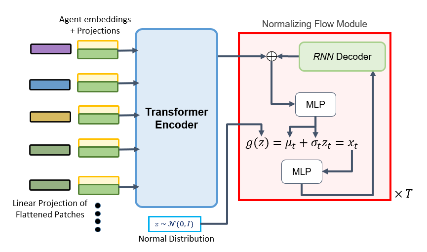

# Trajformer




Official implementation (PyTorch) of the paper: \
**Trajformer: Trajectory Prediction with Local Self-Attentive Contexts for Autonomous Driving**, 2020 [[arXiv]](https://arxiv.org/abs/2011.14910)
[Accepted to ML4AD NeurIPS 2020]

Effective feature-extraction is critical to models’ contextual understanding, particularly for applications to robotics and autonomous driving, such as multimodal
trajectory prediction. However, state-of-the-art generative methods face limitations
in representing the scene context, leading to predictions of inadmissible futures.
We alleviate these limitations through the use of self-attention, which enables
better control over representing the agent’s social context; we propose a local
feature-extraction pipeline that produces more salient information downstream,
with improved parameter efficiency. We show improvements on standard metrics
(minADE, minFDE, DAO, DAC) over various baselines on the Argoverse dataset.

[Video](https://ml4ad.github.io/)

Updates:
* After hearing about the feedback for the delay in the code-base publications, we are addressing some concerns.

 The root codebase (GPLv2) has been committed to the repository, the encoder will be added into utils next with approved licence.

* We are updating the code to include transformer encoders

If you find this work useful, please consider citing:
```
@article{trajformer2020,
  title={Trajformer: Trajectory Prediction with Local Self-Attentive Contexts for Autonomous Driving},
  author={Bhat, Manoj, Francis, Jonathan, Oh, Jean},
  journal={arXiv preprint arXiv:2011.14910},
  year={2020}
}
```
